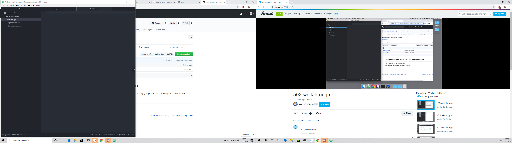

# Assignment-02
## Mathew Peters

I added this particular class because the in-person version was cancelled. I am taking web design for my major, which is media arts focusing on graphic design. I also would like to be able to make a webpage for my clients for when I do art commission projects. I am hoping this cores gives me knowledge to do that in the future.

I wish to learn the following:
- What makes a good web page layout
- How to write code for the site
- How to create hypertext links

[Youtube home page](https://www.youtube.com/)

[Responses](./responses.txt)

