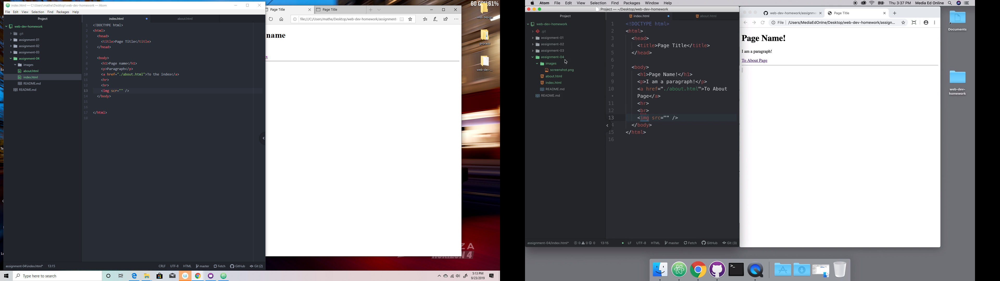

# Assignment 04
## Mathew Peters
1: The site I chose to visit was YouTube in the year 2008. The layout is vastly different however, the general idea is similar to what is seen today. Both in 2009 and 2019, the main page was full of featured popular videos and a search bar.
2: I understood everything up until we started typing hypertext. for some reason the links would not appear for me but I soon solved the issue by fixing a syntax error.

